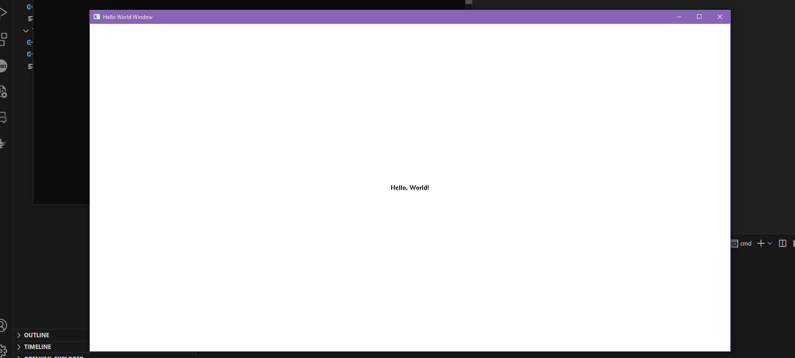
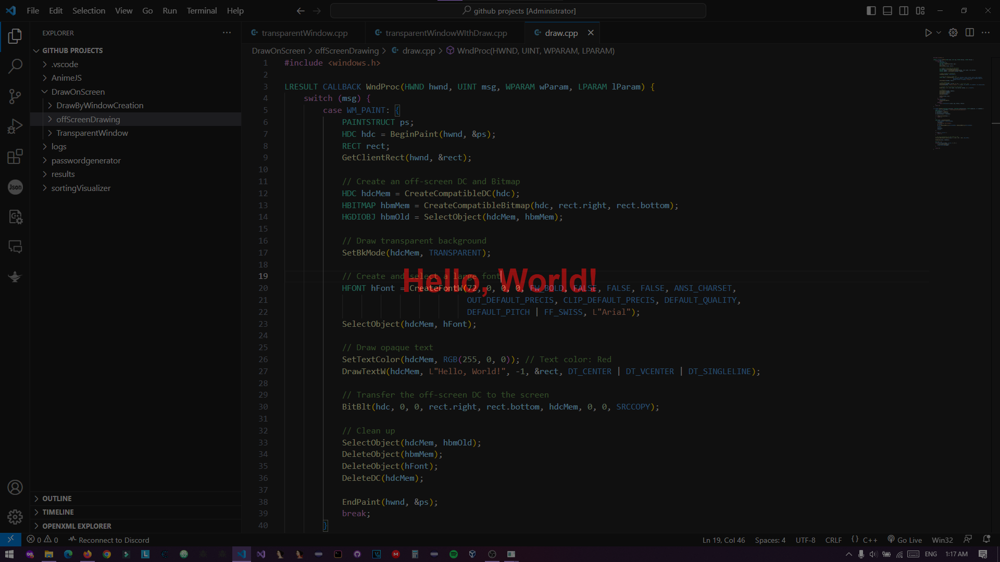

# WinDrawMasterpieces
Unlock the mysteries of the Windows API with WinDrawMasterpieces! Dive into C++ examples to create windows and draw, from basic to advanced off-screen techniques.


# Windows Drawing Examples 🎨🖼️🖥️

## Table of Contents 📚
1. [Introduction](#introduction-🌟)
2. [Project Description](#project-description-📝)
3. [Tech Stack](#tech-stack-🛠️)
4. [Setup](#setup-⚙️)
5. [Usage](#usage-🛠️)
    - [Basic Example: Window Creation](#basic-example-window-creation-🖼️)
    - [Advanced Example: Off-Screen Drawing](#advanced-example-off-screen-drawing-🌈)
6. [Images](#images-📸)
7. [Disclaimer](#disclaimer-🚨)
8. [License](#license-📜)

## Introduction 🌟
Are you intrigued by the Windows API but find it to be like forbidden knowledge? You're not alone! There are surprisingly few tutorials out there on using the Windows API for various tasks. This repository aims to break that barrier by providing examples of how to create a window and draw using the Windows API.

## Project Description 📝
This repository contains two distinct C++ examples that demonstrate the use of the Windows API for drawing:
- `drawByWindowCreation.cpp`: A basic example that opens a window and allows for drawing within it.
- `drawOffScreen.cpp`: An advanced example that demonstrates off-screen drawing in an always-on-top transparent window.

## Tech Stack 🛠️
- C++
- Windows API

## Setup ⚙️
### Prerequisites
- Windows OS
- C++ Compiler (e.g., GCC, MSVC)

### Steps
1. Clone this repository.
2. Navigate to the repository's root directory.
3. Compile the desired C++ file.
```
g++ drawByWindowCreation.cpp -o drawByWindowCreation.exe
g++ drawOffScreen.cpp -o drawOffScreen.exe
```

## Usage 🛠️
### Basic Example: Window Creation 🖼️
Run `drawByWindowCreation.exe` to execute the basic example. A window will pop up where you can see the drawing.



### Advanced Example: Off-Screen Drawing 🌈
Run `drawOffScreen.exe` to execute the advanced example. This will create an always-on-top transparent window that allows you to draw off-screen.



## Images 📸
Both the basic and advanced examples come with images to showcase what each example is capable of. These images are stored in the repository and are named `drawByWIndowCreation.png` and `drawoffscreeen.png` respectively.

## Disclaimer 🚨
**IMPORTANT:** Please read this disclaimer carefully before downloading, copying, or doing anything with this repository.

This project has the potential to be used for creating harmful software, like viruses, malware, etc. The author and contributors are not responsible for any misuse of this code.

## License 📜
Given the sensitive nature of the code's capabilities, this project is licensed under the [GNU Affero General Public License v3 (AGPL-3.0)](https://www.gnu.org/licenses/agpl-3.0.html) to ensure that any derivative work will be open source and its code disclosed.


